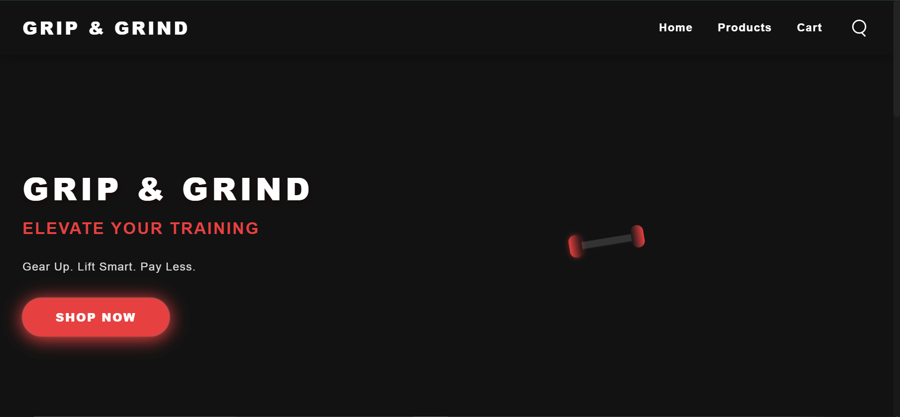

# 🏋️‍♂️ GRIP & GRIND - Gym Accessories Store

A modern and stylish landing page for a fictional gym accessories brand **GRIP & GRIND**.  
The site highlights featured products, promotions, testimonials, and has smooth animations with a fully responsive design.

---

## ✨ Features
- 🚀 Hero section with animated dumbbell
- 🛒 Featured products with scroll-triggered animations
- 💬 Customer testimonials
- 📱 Responsive navigation (mobile-friendly)
- 🌙 Dark-themed modern UI
- 🔗 Footer with social media icons

---

## 🛠️ Technologies Used
- **HTML5** for structure
- **CSS3** (custom animations & responsive design)
- **JavaScript (ES6)** for navigation & scroll-triggered animations

---

## 🚀 Getting Started
### 1. Clone the repository
```bash
git clone https://github.com/mee-ravvii/grip-grind.git
cd grip-grind
```

### 2. Open the project
Simply open `app.html` in your browser.  
No server setup required.

---

## 📷 Screenshots


---

## 📌 Future Improvements
- Add a working shopping cart
- Connect to a backend for orders
- Add user authentication
- Add product filtering & categories

---

## 📄 License
This project is licensed under the [MIT License](./LICENSE).
