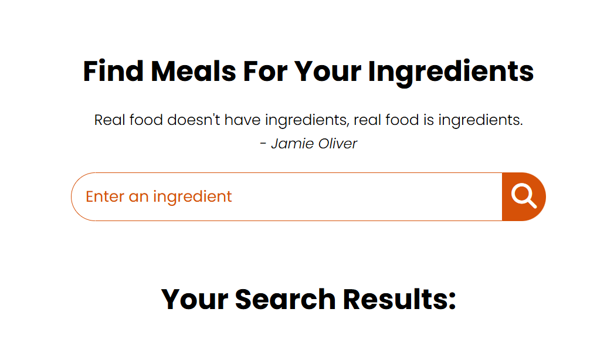

# 🍳 Recipe Finder App

A simple web app that helps you discover delicious recipes based on the ingredients you have.  
Built with **HTML, CSS, and JavaScript**, this project fetches data from [TheMealDB API](https://www.themealdb.com/) and displays meals with detailed recipes.

---

## ✨ Features
- 🔍 Search meals by ingredients
- 📸 Display meal images and names
- 📖 View detailed recipe instructions
- 🎥 Direct YouTube link for video tutorials
- 📱 Responsive design for all screen sizes

---

## 🛠️ Technologies Used
- **HTML5** for structure
- **CSS3** (with Google Fonts & FontAwesome) for styling
- **JavaScript (ES6)** for API calls & interactivity
- **TheMealDB API** as the recipe database

---

## 🚀 Getting Started
### 1. Clone the repository
```bash
git clone https://github.com/mee-ravvii/recipe-finder.git
cd recipe-finder
```

### 2. Open the project
Simply open `recipeWeb.html` in your browser.  
No additional setup is required.

---

## 📷 Screenshots



---

## 📌 Future Improvements
- Add option to search by category/cuisine
- Save favorite recipes locally
- Improve accessibility and UI animations

---

## 📄 License
This project is licensed under the [MIT License](./LICENSE).
